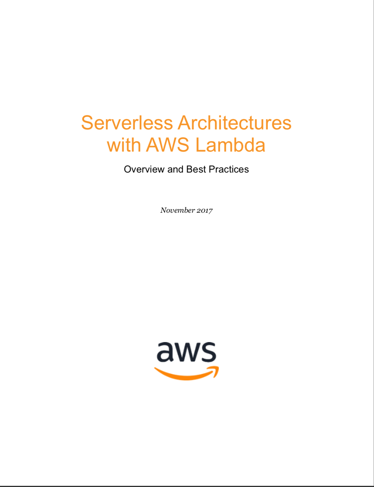

# AWS Lambda无服务器架构(概述与最佳实践)

   

## 原文
- [pdf](serverless-architectures-with-aws-lambda.pdf)  
- [word](serverless-architectures-with-aws-lambda.doc)

## 目录
- [介绍 - 什么是无服务器？](introduction.md)
- [AWS Lambda — 基本概念](aws_lambda-the_basic.md)
- [AWS Lambda — 深入研究](aws_lambda-diving_deeper.md)
  - Lambda函数代码
  - Lambda函数事件源
  - Lambda函数配置
- [无服务器最佳实践](serverless_best_practices.md)
  - [无服务器架构的最佳实践](serverless_architecture_best_practices.md)
    - 安全最佳实践
    - 可靠性最佳实践
    - 高效性能最佳实践
    - 卓越运维最佳实践
    - 成本优化最佳实践
  - [无服务器开发最佳实践](serverless_development_best_practices.md)
    - 架构及代码 - AWS服务器应用模型（AWS SAM）
    - 本地测试 - AWS SAM Local
    - 代码编写与代码管理最佳实践
    - 测试
    - 持续推送
- [无服务器架构样例](sample_serverless_architecture.md)
- [总结](conclusion.md)
- [贡献者](contributors.md)

