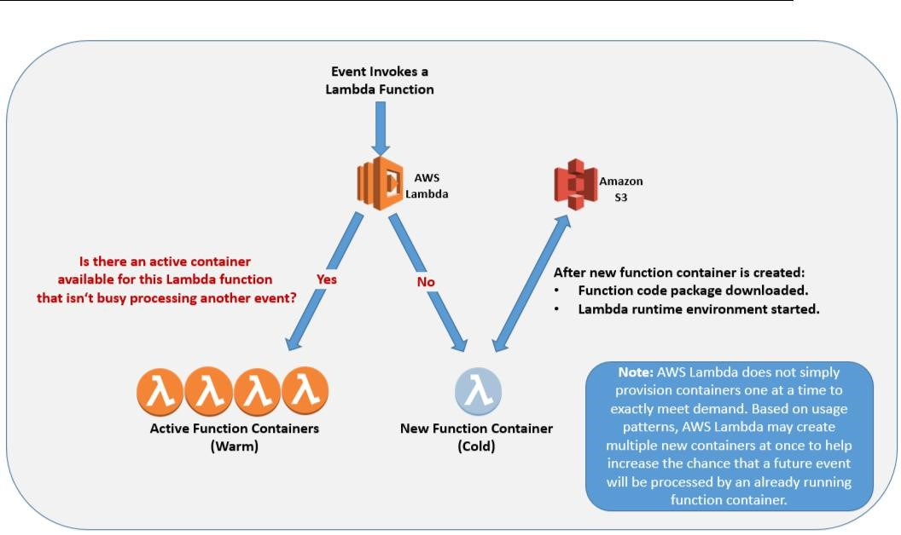

## AWS Lambda — 深入研究

本白皮书的其余部分将帮助你理解Lambda的组件和特性，以及在使用Lambda构建和拥有无服务器应用时的各方面的最佳实践。

让我们从进一步扩展和解释在介绍中描述的Lambda的每个主要组件开始深入研究:函数代码、事件源和函数配置。

### Lambda函数代码

其核心是使用Lambda来执行代码。这可以用Lambda (Java, Node)支持的任何语言编写的代码。以及在编写代码时上传的任何代码或包。你可以自由地将任何库、构件（artifacts）或已编译的本地二进制文件作为函数代码包的一部分在运行时环境上执行。如果愿意，你甚至可以执行用另一种编程语言(PHP、Go、SmallTalk、Ruby等)编写的代码，只要在AWS Lambda运行时环境所支持的一种语言中上传然后调用该代码（[请查看教程](https://aws.amazon.com/cn/blogs/compute/scripting-languages-for-aws-lambda-running-php-ruby-and-go/)）。

Lambda运行时环境基于Amazon Linux AMI(请参阅[此处](https://docs.aws.amazon.com/lambda/latest/dg/current-supported-versions.html)的当前环境细节)，因此你应该在匹配的环境中编译和测试计划在Lambda内部运行的组件。为了帮助你在Lambda内部运行之前执行这种类型的测试，AWS提供了一组名为[AWS SAM Local](https://github.com/awslabs/aws-sam-cli)的工具来支持Lambda函数的本地测试。我们将在本文的无服务器开发最佳实践部分讨论这些工具。

#### 函数代码包
功能代码**包**包含你希望在执行代码时在本地可用的所有组件。一个包将至少包括函数在被调用时你希望Lambda服务执行的代码函数。但是，它也可能包含代码在执行时引用的其它组件，例如，代码将导入的其他文件、类和库、希望执行的二进制文件或代码在被调用时引用的配置文件。在发布时，函数代码包的最大压缩大小为50M，最大解压大小为250M。（有关AWS Lambda限制的完整列表，请参阅[此文档](https://docs.aws.amazon.com/lambda/latest/dg/limits.html)）

当创建Lambda函数时(通过AWS管理控制台，或者使用CreateFunction API)，可以引用上传包的S3 bucket和对象key。或者，在创建函数时直接上传代码包。Lambda将代码包存储在由该服务管理的S3 bucket中。当你将更新的代码发布到现有的Lambda函数时，也可以使用相同的选项（通过[UpdateFunctionCode](https://docs.aws.amazon.com/zh_cn/lambda/latest/dg/API_UpdateFunctionCode.html) API）。

当事件发生时，你的代码包将从S3 bucket下载，安装在Lambda运行时环境中，并根据需要进行调用。在Lambda管理的环境中，按照触发函数事件数量所需的规模，按需进行伸缩。

#### 处理程序

当Lambda函数被调用时，代码执行从所谓的**处理程序**开始。处理程序是你创建并包含在程序包中的特定代码方法（Java，C＃）或函数（Node.js，Python）。在创建Lambda函数时指定处理程序。Lambda支持的每种语言对于如何在包中定义和引用函数处理程序都有自己的要求。

下面的链接将帮助你开始使用每种被支持的语言。

| 语言 | 定义处理程序示例  |
| ------ | --------- |
|  [Java](https://docs.aws.amazon.com/zh_cn/lambda/latest/dg/java-programming-model.html)  | `MyOutput output handlerName(MyEvent event, Context context) {` |
|        | ` ...` |
|        | ` }` |
|  [Node.js](https://docs.aws.amazon.com/zh_cn/lambda/latest/dg/programming-model.html)  | `exports.handlerName = function(event, context, callback) {` |
|        | ` ...` |
|        | ` // callback parameter is optional` |
|        | ` }` |
|  [Python](https://docs.aws.amazon.com/zh_cn/lambda/latest/dg/python-programming-model.html)  | `def handler_name(event, context):` |
|        | ` ...` |
|        | `return some_value` |
|  [C#](https://docs.aws.amazon.com/zh_cn/lambda/latest/dg/dotnet-programming-model.html)  | `myOutput HandlerName(MyEvent event, ILambdaContext context) {` |
|        | ` ...` |
|        | ` }` |

一旦在Lambda函数中成功调用处理程序，运行时环境就属于你编写的代码。Lambda函数可以自由执行你认为合适的任何逻辑，由你在处理程序中开始编写的代码驱动。这意味着处理程序可以调用你所上传的文件和类中的其他方法和函数。代码可以导入上传的第三方库，并安装和执行上传的本地二进制文件(只要它们能够在Amazon Linux上运行)。它还可以与其他AWS服务交互，或者向它所依赖的web服务发出API请求，等等。

#### 事件对象

以一种被支持的语言编写Lambda函数且当其被调用时，提供给处理程序函数的参数之一是**事件对象**。事件的结构和内容不同，具体取决于创建它的事件源。事件参数的内容包括Lambda函数驱动其逻辑所需的所有数据和元数据。例如，由API网关创建的事件将包含与API客户端发出的HTTPS请求相关的详细信息（例如，路径，查询字符串，请求体），而一个由Amazon S3创建新对象时所引起的事件将包括bucket和新对象的详细信息。

#### 上下文对象

Lambda函数还被提供了一个**上下文对象**。下文对象允许函数代码与Lambda执行环境进行交互。根据Lambda函数使用的语言运行时，上下文对象的内容和结构会有所不同，但至少它将包含：
- AWS RequestId - 用于跟踪Lambda函数的特定调用（对于错误报告或与联系AWS Support时非常重要）
- 剩余时间 - 函数超时发生前剩余的毫秒数（Lambda函数在发布时最多可以运行300秒，但是可以配置更短的超时）
- 日志 - 每种语言运行时都提供了将日志语句输出到Amazon CloudWatch日志的功能。上下文对象包含有关将日志语句发送到哪个CloudWatch Logs流的信息。在每一种语言运行时日志是如何被处理的更多信息，请参见以下内容：
  1. [Java](https://docs.aws.amazon.com/zh_cn/lambda/latest/dg/java-logging.html)
  2. [Node.js](https://docs.aws.amazon.com/zh_cn/lambda/latest/dg/nodejs-prog-model-logging.html)
  3. [Python](https://docs.aws.amazon.com/zh_cn/lambda/latest/dg/python-logging.html)
  4. [C#](https://docs.aws.amazon.com/zh_cn/lambda/latest/dg/dotnet-logging.html)

#### 编写AWS Lambda代码 - 无状态与复用

在为Lambda编写代码时，理解中央租户非常重要：**你的代码不能对状态进行假设**。这是因为当函数容器第一次被创建并被调用时，Lambda全托管服务。出于多种原因，容器可以第一次被调用。比如，触发Lambda函数的事件的并发量正在增加，超出了之前为函数创建的容器数量，事件在几分钟内第一次触发Lambda函数，等等。Lambda负责弹性伸缩函数容器以满足实际需求，而代码需要能够相应地进行操作。尽管Lambda不会中断正在运行的特定调用的处理，但是你的代码不需要考虑这种级别的波动性。

这意味着你的代码无法做出任何假设，即状态将从一次调用保留到下一次。但是，函数容器每次被创建和调用时，它都会保持活动状态，并且在终止之前至少有几分钟时间可用于后续调用。当之前已经被激活并至少被调用过一次的容器上发生后续调用时，我们说调用是在一个**已预热容器**上运行的。当Lambda函数发生调用时，需要首次创建和调用函数代码包，我们说调用正在经历一个**冷启动**。

根据代码执行的逻辑，了解代码如何利用已预热容器的优势可以在Lambda中实现更快的代码执行。反过来，这会导致更快的响应和更低的成本。有关如何利用已预热容器提高Lambda函数性能的更多详细信息和示例，请参阅本白皮书后续的“最佳实践”部分。

总的来说，Lambda支持的每种语言都有自己的打包源代码模型和优化可能性。访问[此页面](https://docs.aws.amazon.com/lambda/latest/dg/programming-model-v2.html)以开始使用每种支持的语言。

### Lambda函数事件源

现在你已经知道Lambda函数代码的组成部分，接下来让我们看看调用代码的**事件源**或触发器。虽然Lambda提供了调用API以能够直接调用函数，但你可能只会将其用于测试和运维。相反，你可以将Lambda函数与AWS服务中发生的事件源关联起来，这些事件源将根据需要调用函数。你不必编写、伸缩或维护将事件源与Lambda函数集成在一起的任何软件。

#### 调用模式
调用Lambda函数有两种模型：
- 推送模式 - 在另一个AWS服务中每次发生特定事件时，都会调用Lambda函数（比如，新对象被添加到S3 bucket）
- 拉取模式 - Lambda轮询数据源并使用到达数据源的任何新记录调用你的函数，在单个函数调用中将新记录批处理（比如，Amazon Kinesis或者Amazon DynamoDB流中的新纪录）

此外，Lambda函数可以同步或异步执行。触发Lambda函数时，你可以使用提供的参数**调用类型（InvocationType）**以选择执行类型，这个参数有三个可能的值：
- 请求响应 - 同步执行。
- 事件 - 同步执行。
- 排练（DryRun）- 测试调用方是否允许调用，但不要执行该函数。

每个事件源指定如何调用函数。事件源还负责生成自己的事件参数，如前所述。

下面的表提供了一些更流行的事件源如何与Lambda函数集成的详细信息。你可以在[这里](http://docs.aws.amazon.com/lambda/latest/dg/invoking-lambda-function.html)找到支持的事件源的完整列表。

#### 推送模式事件源

##### Amazon S3

|  |  |
| ------ | --------- |
|  调用模式  | 推送 |
|  调用类型  | 事件 |
|  说明  | S3事件通知(如ObjectCreated和ObjectRemoved)在发布时可以将其配置成调用Lambda函数|
|  用例案例  | 为用户通过应用程序上传到S3 bucket的图像创建图像修改（缩略图，不同分辨率，水印等）|
| | 处理上传到S3 bucket的原始数据，并将转换后的数据作为大数据管道的一部分移动到另一个S3 bucket|

##### Amazon API Gateway

|  |  |
| ------ | --------- |
|  调用模式  | 推送 |
|  调用类型  | 事件或请求响应 |
|  说明  | 使用API Gateway创建的API方法可以使用Lambda函数作为其服务后端。如果选择Lambda作为API方法的集成类型，则会同步调用Lambda函数（Lambda函数的响应用作API响应）。使用此集成类型，API Gateway还可以充当Lambda函数的简单代理。 API网关不会自行执行任何处理或转换，并将请求的所有内容传递给Lambda。|
| | 如果你希望API作为事件异步调用函数并立即返回空响应，则可以将API Gateway用作AWS服务代理(AWS Service Proxy)，并与Lambda调用API(Lambda Invoke API）集成，在请求标头中提供事件调用类型（Event InvocationType)。如果API客户端不需要基于请求返回任何信息并且希望获得尽可能快地响应时间，那么这是一个很好的选择。（此选项非常适合将用户在网站或应用上的交互推送到服务后端进行分析。）|
|  用例案例  | Web服务后端（Web应用，移动应用，微服务架构等）|
| | 遗留服务集成(Lambda函数，用于将遗留SOAP后端转换为新的现代REST API)。|
| | 任何其他用例，将HTTPS作为应用程序组件之间的恰当集成机制|

##### Amazon SNS

|  |  |
| ------ | --------- |
|  调用模式  | 推送 |
|  调用类型  | 事件 |
|  说明  | 发布到SNS主题的消息可以作为事件传递到Lambda函数。|
|  用例案例  | 自动响应CloudWatch告警。|
| | 处理来至于可以原生推送消息到SNS主题的其他服务（AWS或其他）的事件。|

##### AWS CloudFormation

|  |  |
| ------ | --------- |
|  调用模式  | 推送 |
|  调用类型  | 请求响应 |
|  说明  | 作为部署AWS CloudFormation堆栈的一部分，可以将Lambda函数指定为自定义资源，以执行任何自定义命令并将数据提供回正在进行的堆栈创建。|
|  用例案例  | 扩展AWS CloudFormation功能以囊括AWS CloudFormation本身尚未支持的AWS服务特性。|
| | 在堆栈创建/更新/删除过程的关键阶段执行自定义验证或报告。|

##### Amazon CloudWatch Events

|  |  |
| ------ | --------- |
|  调用模式  | 推送 |
|  调用类型  | 事件 |
|  说明  | 许多AWS服务将资源状态更改发布到CloudWatch Events。然后可以过滤这些事件并将其路由到Lambda函数以进行自动响应。|
|  用例案例  | 事件驱动的操作自动化（例如，每次启动新的EC2实例时执行操作，当AWS Trusted Advisor报告新的状态更改时通知适当的邮件列表）。|
| | 替换先前使用cron完成的任务（CloudWatch Events支持已预定事件）。|

##### Amazon Alexa

|  |  |
| ------ | --------- |
|  调用模式  | 推送 |
|  调用类型  | 请求响应 |
|  说明  |