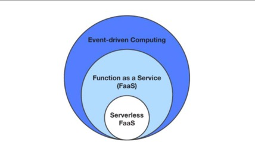
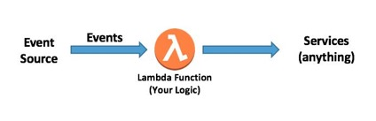

## AWS Lambda—基本概念

Lambda是一个基于函数的大规模、无需提供资源的无服务器计算产品。它为应用程序提供了云逻辑层。Lambda函数可以由发生在AWS或支持第三方服务上的各种事件触发。它们使你能够构建响应式，事件驱动的系统。当有多个并发事件需要响应时，Lambda只需并行地运行函数的更多副本。Lambda函数随工作负载进行精确扩容，也能为单独请求进行收缩。因此，拥有空闲服务器或容器的可能性非常低。使用Lambda函数的架构旨在减少闲置容量。

Lambda可以被描述为一种无服务器函数即服务(FaaS)类型。FaaS是构建事件驱动计算系统的一种方法。它依赖于函数作为部署和执行的单元。无服务器FaaS是一种FaaS，在这种FaaS中，编程模型里不存在虚拟机或容器，并且供应商提供资源免费的伸缩性和内置可靠性。

图1显示了事件驱动计算，FaaS和无服务器FaaS之间的关系。

图1: 事件驱动计算，FaaS和无服务器FaaS之间的关系

使用Lambda，可以运行几乎任何类型的应用或后端服务的代码。Lambda以高可用性运行和扩展代码.

创建的每个Lambda函数都包含希望执行的  **代码**、定义代码如何执行的 **配置**，以及一个或多个 **事件源** (可选)，这些事件源在事件发生时检测事件并调用函数。下一节将更详细地讨论这些元素。

事件源的一个案例是API网关，在任何时候，它可以在使用API网关创建的API方法接收HTTPS请求时调用Lambda函数。另一个例子是Amazon SNS，它可以在新消息发布到SNS主题时随时调用Lambda函数。许多事件源选项可以触发Lambda函数。有关完整列表，请参阅此[文档](https://docs.aws.amazon.com/lambda/latest/dg/invoking-lambda-function.html)。Lambda还提供RESTful服务API，其中包括直接[调用Lambda函数](https://docs.aws.amazon.com/lambda/latest/dg/API_Invoke.html)的功能。你可以使用此API直接执行代码，而无需配置其他事件源。

你不需要编写任何代码将事件源与Lambda函数进行集成，也不需要管理任何检测事件并将其推送到函数的基础设施，也不需要管理扩展Lambda函数以匹配被推送事件的数量。你可以只专注于应用逻辑，配置数据源以运行逻辑。

Lambda函数在如图2所示的(简化的)架构运行。

图2 运行Lambda函数的简化体系结构

一旦为函数配置了事件源，事件发生时就会调用代码。代码可以执行任何业务逻辑、外部web服务、与其他AWS服务集成，或者应用需要的任何其他东西。使用Lambda时，你所选语言的那些你习惯使用的所有同样功能与软件设计原则都将适用。此外，由于在无服务器应用中通过集成Lambda函数和事件源强制实现了固有的解耦，因此使用Lambda函数自然适应于微服务的构建。

对无服务器原则和Lambda有了基本的了解之后，就可以开始编写一些代码了。下面的参考资料将帮助您立即开始使用Lambda：
- [Hello World指导](https://docs.aws.amazon.com/lambda/latest/dg/getting-started-create-function.html)
- [用于构建示例应用程序的无服务器研讨会和演练](https://github.com/aws-samples/aws-serverless-workshops)
  

