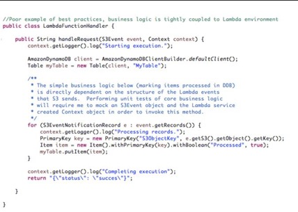

#### 代码编写与代码管理最佳实践

在为Lambda函数开发代码时，有一些关于你应该如何编写和组织代码的具体建议，以便管理许多Lambda函数不会成为一项复杂的任务。

##### 代码编写最佳实践

根据使用的Lambda运行时语言，继续遵循为该语言建立的最佳实践。虽然围绕代码调用方式的环境已随Lambda发生了更改, 但语言运行时环境与其他任何地方相同。代码编写标准和最佳实践仍然适用。以下建议是特定于为Lambda编写代码，而不是所选择的语言的一般最佳实践。

###### 业务逻辑在Handler之外

Lambda函数在代码包中定义的处理函数处开始执行。在处理函数中，你应该会接收到Lambda提供的参数，将这些参数传递给另一个函数以解析应用上下文化的新变量/对象，然后转到位于处理函数和文件之外的业务逻辑。这使你能够创建尽可能与Lambda运行时环境解耦的代码包。这将极大地有利于在你所创建的对象和函数的上下文中测试代码的能力，并复用在Lambda之外的其他环境中编写的业务逻辑。

下面的示例(用Java编写)展示了应用程序的核心业务逻辑与Lambda紧密耦合的糟糕实践。在本例中，业务逻辑是在处理程序方法中创建的，并直接依赖于Lambda事件源对象。

###### 容器预热 - 缓存/长连接/复用

如前所述，你应该编写利用预热函数容器的代码。这意味着以一种可能在后续调用中复用变量及其内容的方式确定变量的范围。这对于诸如引导配置、保持外部依赖关系连接的打开，或者可以从一个调用持续到下一个调用的大型对象的一次性初始化等情况尤其有效。

###### 依赖控制

Lambda执行环境包含许多库，例如用于Node.js的AWS SDK和Python运行时。（有关完整列表，请参阅[Lambda执行环境和可用库](https://docs.aws.amazon.com/lambda/latest/dg/current-supported-versions.html)。）为了启用最新的功能和安全更新，Lambda会定期更新这些库。这些更新可能会对Lambda函数的行为进行细微更改。要完全控制函数使用的依赖项，我们建议你使用部署包打包所有依赖项。

###### 依赖修剪

Lambda函数代码包在压缩时最多允许为50MB，在运行时环境中压缩时最多允许为250MB。如果在函数代码中包含大型依赖组件，则可能需要将所包含的依赖项修剪为仅运行时的必需项。这也允许在冷启动时更快地下载和安装Lambda函数代码。

###### 快速失败

为任何外部依赖项配置合理短的超时，以及合理短的总体Lambda函数超时。不要让函数在等待依赖项响应时无助地旋转。因为Lambda是根据函数执行的持续时间计费的，所以当函数依赖无响应时，你不希望产生高于必要的费用。

###### 异常处理

你可能决定根据Lambda的用例以不同的方式抛出和处理异常。