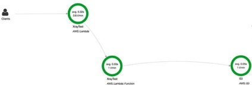

#### 高效性能最佳实践

在我们深入讨论性能最佳实践之前，请记住，如果你的用例可以通过异步实现，那么你可能不需要关心函数的性能(除了优化成本)。你可以利用将使用事件**InvocationType**或者使用基于拉取调用模型的事件源其中之一。单独使用这些方法可能允许应用逻辑继续执行，而Lambda继续单独处理事件。如果要优化Lambda函数的执行时间，那么Lambda函数的执行时间将主要受到三种因素的影响(按照最简单的优化顺序):在函数配置中分配的资源、选择的语言运行时和编写的代码。

##### 选择最佳内存大小

Lambda提供一个单刻度盘来调高或调低函数可用的计算资源的数量 - 分配给函数的RAM的数量。分配给RAM的数量还会影响函数接收到的CPU时间和网络带宽。简单地选择能够充分快速运行函数的最小资源量是一种反面模式。因为Lambda是以100毫秒的增量计费的，所以这种策略不仅会增加应用程序的延迟，而且如果所增加的延迟超过了节省的资源成本，那么这种策略的总体成本可能会更高。

我们建议你在每个可用资源级别测试Lambda函数，以确定应用程序的最佳性价比水平。你会发现，随着资源水平的提高，函数的性能应该以对数方式改进。正在执行的逻辑将定义函数执行时间的下限。还有一个资源阈值，函数可用的任何额外RAM/CPU/带宽不再提供任何实质性的性能增益。但是，随着资源水平的增加，定价会线性增加。你的测试应该找到对数函数弯曲的位置，以便为函数选择最佳配置。

下面的图显示了如何将理想内存分配给示例函数，以实现更低成本和延迟。通过分配更多资源，在函数中减少的延迟量超过了使用512MB而不是较低内存选项的每100ms的额外计算成本。但是在512 MB之后，这个特定函数逻辑的性能提升会变弱，因此现在每100ms的额外成本会使总成本更高。这使得512MB成为最小化总成本的最佳选择。

图4: 选择Lambda函数最佳内存大小

函数的内存使用由每次调用决定，可以在[CloudWatch日志](http://docs.aws.amazon.com/AmazonCloudWatch/latest/monitoring/WhatIsCloudWatchLogs.html)中查看。

    REPORT RequestId: 3604209a-e9a3-11e6-939a-754dd98c7be3 Duration: 12.34 ms Billed Duration: 100 ms Memory Size: 128 MB Max Memory Used: 18 MB

通过分析字段Max Memory Used：，可以确定函数是否需要更多内存，或者是否过度配置了函数的内存大小。

##### 语言运行时性能

选择一种语言运行时性能显然取决于你对每种受支持运行时的熟悉程度和技能。但是，如果性能是应用程序的主要考虑因素，那么每种语言的性能特征就是你在Lambda上所期望的，就像在其他运行时环境中所期望的那样：编译型语言(Java和. net)为容器的第一次调用带来了最大的初始启动成本，但对于后续的调用却显示了最佳的性能。与编译型语言相比，解释型语言(Node.js和Python)具有非常快的初始调用时间，但是不能达到与编译型语言相同的最大性能水平。

如果应用用例对延迟非常敏感，并且容易频繁地受到引起初始调用成本(非常繁忙的流量或非常不频繁的使用)的影响，我们建议使用一种解释语言。

如果应用在其流量模式中没有遇到大的高峰或低谷，或者在Lambda函数响应时间上没有用户体验阻塞，我们建议选择已经最熟悉的语言。

##### 优化代码

Lambda函数的大部分性能取决于需要执行的逻辑及其依赖关系。我们将不讨论所有这些优化可能是什么，因为它们因应用的不同而不同。但是有一些通用的最佳实践可以优化针对Lambda的代码。这与利用容器复用(如前面概述中所述)和最小化冷启动的初始成本有关。下面是几个示例，说明在调用已预热容器时如何改进函数代码的性能：
- 初始执行后，存储并引用代码在本地检索的任何外部化配置或依赖项。
- 限制每次调用时变量/对象的重新初始化（使用全局/静态变量，单例等）。
- 保持活动并复用在先前调用期间建立的连接（HTTP，数据库等）。

最后，应该执行以下操作来限制Lambda函数冷启动所花费的时间：
- 除非需要通过专用IP连接到VPC内的资源，否则始终使用默认网络环境。这是因为存在与Lambda函数的VPC配置相关的其他冷启动方案（与在VPC中创建ENI相关）。
- 选择解释语言而不是编译语言。
- 将函数代码包调整为只包含运行时的必需部分。这减少了在调用之前从Amazon S3下载代码包所需的时间。

##### 理解应用性能

为了了解应用架构的各个组件(可能包括一个或多个Lambda函数)，我们建议您使用[AWS X-Ray](https://aws.amazon.com/xray/)。X-Ray允许你通过每个组件部分跟踪应用请求的完整生命周期，分别显示每个组件的延迟和其他指标，如下图所示。

图5: AWS X-Ray可视化服务地图

要了解更多关于X-Ray的信息，请参阅[本文档](https://docs.aws.amazon.com/lambda/latest/dg/lambda-x-ray.html)。
