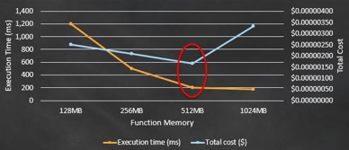

### 无服务器架构的最佳实践

AWS Well-Architected Framework包含的策略可帮助你将工作量与我们的最佳实践进行比较，并获得生成稳定高效系统的指导，以便你可以专注于功能需求。它基于五大支柱:安全性、可靠性、性能效率、成本优化和卓越运营。框架中的许多准则适用于无服务器应用。但是，有一些特定的实现步骤或模式对于无服务器架构是唯一的。在以下部分中，我们将针对每个Well-Architected支柱介绍一组无服务器的专用推荐。

#### 安全最佳实践

在应用中设计和实现安全性应始终是第一优先级 - 这不会因无服务器架构而改变。与服务器托管的应用相比，保护无服务器应用的主要区别显而易见 - 没有服务器可供保护。但是，你仍需要考虑应用程序的安全性。无服务器安全性仍然存在责任共担模型。

使用Lambda和无服务器架构，而不是通过防病毒/恶意软件，文件完整性监控，入侵检测/防御系统，防火墙等实现应用安全性，你可以通过编写安全的应用代码，对源代码更改进行严格的访问控制来确保实现安全性最佳实践，并对与Lambda函数集成的每个服务遵循AWS安全最佳实践。

下面是应该应用于许多无服务器用例的无服务器安全性最佳实践的简要列表，尽管你自己的特定安全性和合规要求应该得到很好的理解，并且可能包括比我们在这里描述的更多的内容。
- **每个函数一个IAM角色**
   您的AWS账户中的每个Lambda函数都应与IAM角色具有1：1的关系。即使多个函数以完全相同的策略开始，也要始终解耦IAM角色，以便可以确保在将来为函数使用最少的权限策略。
   例如，如果你共享Lambda函数的IAM角色，该角色需要跨多个Lambda函数访问AWS KMS密钥，那么所有这些函数现在都可以访问相同的加密密钥。
- **临时AWS凭证**
  Lambda函数代码或配置中不应该包含任何长期使用的AWS凭据。（这对于静态代码分析工具来说非常有用，可以确保它永远不会出现在您的代码库中！）对于大多数情况，IAM执行角色是与其他AWS服务集成所需的全部内容。对于大多数情况，IAM执行角色是与其他AWS服务集成所需的全部内容。只需通过AWS SDK在代码中创建AWS服务客户端，而无需提供任何凭证。为角色生成的临时凭证，SDK会自动管理其检索和轮换。以下是使用Java的示例。

    *AmazonDynamoDB client = AmazonDynamoDBClientBuilder.defaultClient();*
    *Table myTable = new Table(client, "MyTable");*

    此代码片段是AWS SDK for Java创建对象以与DynamoDB表进行交互所需的全部内容，该表使用分配给函数的临时IAM凭据自动将其请求签名到DynamoDB API。

    但是，在某些情况下，执行角色没有足够多的函数所需的访问类型。此情况可能是由于Lambda函数执行了一些跨账户集成，或者你通过联合[Amazon Cognito](https://aws.amazon.com/cn/cognito/)认证角色与[DynamoDB细粒度访问控制](https://docs.aws.amazon.com/amazondynamodb/latest/developerguide/specifying-conditions.html)以实现特定用户的访问控制策略。对于跨账户用例，你应该授权执行角色内授予访问[AWS Security Token Service](https://docs.aws.amazon.com/STS/latest/APIReference/Welcome.html)中的AssumeRole API，并将其集成以检索临时访问凭证。

    对于特定用户的访问控制策略，应该向函数提供用户身份识别，然后将其与Amazon Cognito API [GetCredentialsForIdentity](https://docs.aws.amazon.com/cognitoidentity/latest/APIReference/API_GetCredentialsForIdentity.html)集成。在这种情况下，你必须确保代码正确地管理这些凭证，以便为与Lambda函数调用相关的每个用户利用正确的凭证。对于应用程序来说，将这些每个用户的凭据加密并存储在DynamoDB或Amazon ElastiCache这样的地方作为用户会话数据的一部分是很常见的，这样，与返回用户的后续请求重新生成凭据相比，可以以更低的延迟和更灵活的伸缩性检索凭据。
- **持久化密码**
  在某些情况下，你可能拥有Lambda函数需要使用的长期密码（例如，数据库凭据，依赖服务访问密钥，加密密钥等）。我们为应用中的密码生命周管理期推荐了一些选项：
  - [使用Encryption Helpers（加密助手）的Lambda环境变量](https://docs.aws.amazon.com/lambda/latest/dg/env_variables.html#env_encrypt)
      **优势** - 提供直接访问函运行时环境，最大限度地减少了检索密码所需的延迟和代码。
      **劣势** - 环境变量与函数版本耦合。更新环境变量需要新的函数版本（更严格的是，但也提供稳定版本历史记录）。
  -  [Amazon EC2 Systems Manager Parameter Store46](https://docs.aws.amazon.com/systems-manager/latest/userguide/systems-manager-paramstore.html)
      **优势** - 与Lambda函数完全解耦，在密码和函数之间提供了最大的灵活性
      **劣势** - 检索参数/密码需要向Parameter Store发送请求。虽然不会实质影响，但这确实会增加环境变量的延迟以及额外的服务依赖性，并且需要编写稍微多一点的代码。
- **使用密码**
  密码应用始终只能存在内存中，永远不能被记录或者写到磁盘上。在应用保持运行的同时，在需要撤消密码的情况下，编写管理密码轮换的代码。
- **API授权**
  使用API网关作为Lambda函数的事件源相对于其他AWS服务事件源选项是独特的，因为你拥有API客户端认证与授权的所有权。API Gateway可以通过提供原生[AWS SigV4身份验证](https://docs.aws.amazon.com/general/latest/gr/signature-version-4.html)，[生成的客户端SDK](https://docs.aws.amazon.com/apigateway/latest/developerguide/how-to-generate-sdk.html)和[自定义授权程序](https://docs.aws.amazon.com/apigateway/latest/developerguide/welcome.html)等功能来执行大量繁重工作。但是，你仍然有责任确保API的安全状态符合设置的标准。有关API安全性最佳实践的详细信息，请参阅[此文档](https://docs.aws.amazon.com/apigateway/latest/developerguide/apigateway-control-access-to-api.html)。
- **VPC Security**
  如果Lambda函数需要访问部署在VPC中的资源，那么应该通过使用最少权限安全组、特定于Lambda函数的子网、网络ACL和路由表来实现网络安全最佳实践，这些表仅允许来自Lambda函数的流量到达预期目的地。
  请记住，这些实践和策略会影响Lambda函数连接到所需依赖的方式。调用Lambda函数仍然通过事件源和Invoke API进行(两者都不受VPC配置的影响)。
- **部署访问控制**
  对UpdateFunctionCode API的调用类似于代码部署。通过UpdateAlias API将别名移动到新发布的版本类似于代码发布。以极高的敏感性对待能开启函数代码/别名的Lambda api的访问。因此，你应该为任何函数(至少是生产函数)消除用户对这些api的直接访问，以消除人为错误的可能性。应通过自动化实现对Lambda函数的代码更改。记住这一点，部署到Lambda的入口点将成为启动持续集成/持续推送管道的地方。这可能是仓库中的发布分支，S3 bucket，其中上传了一个新的代码包，触发[AWS CodePipeline](https://aws.amazon.com/cn/codepipeline/)管道，或者是某个特定于组织和流程的仓库。无论它在哪里，它都成为一个新的地方，在这里你应该执行严格的访问控制机制，以适合团队结构和角色。

#### 可靠性最佳实践

可以构建无服务器应用来支持关键任务用例。就像任何任务关键型应用程序一样，重要的是，你要按照Werner Vogels（Amazon.com的CTO）所提倡的思维模式进行架构，“任何东西总是会失败”。对于无服务器应用程序，这可能意味着在代码中引入逻辑错误、应用程序依赖关系失败以及其他类似的应用程序级别的问题，应该尝试使用仍然适用于无服务器应用程序的现有最佳实践来预防和解决这些问题。对于基础设施级别的服务事件，即从事件中抽象出无服务器应用程序的事件，你应该了解如何对应用程序进行架构设计，以实现高可用性和容错性。

##### 高可用
高可用性对于生产应用程序非常重要。Lambda函数的可用性状态取决于可以在其中执行的可用区的数量。如果函数使用默认的网络环境，那么它可以在AWS区域内的所有可用区自动执行。在默认网络环境中，不需要为函数配置高可用性。如果函数部署在自己的VPC中，子网(及其各自的可用区)将定义在可用区停用时函数是否仍然可用。因此，VPC的设计包含多个可用区的子网是非常重要的。如果出现可用区宕机，剩余子网必须继续拥有足够的IP地址，以支持所需的并发函数数量，这一点非常重要。有关如何计算函数所需的IP地址数量的信息，请参阅[此文档](https://docs.aws.amazon.com/lambda/latest/dg/vpc.html#vpc-setup-guidelines)。

##### 容错
如果需要的应用可用性要求利用多个AWS区域，那么必须在设计前预先考虑这一点。将Lambda函数代码包复制到多个AWS区域并不复杂。与大多数多区域应用程序设计一样，复杂的是协调横跨应用堆栈中的所有层实现容错决定。这意味着你需要理解并编排到另一个AWS区域的转换，不仅要针对Lambda函数，还要针对事件源(以及事件源的上游依赖)和持久性层。最后，多区域架构是非常特定于应用。要使多区域设计可行，最重要的事情是在设计中预先考虑它。

##### 复原

思考下在函数无法被执行的情况下，无服务器应用的行为方式。对于使用API Gateway作为事件源的用例，这可以非常简单，只需优雅地处理错误消息，并提供可行的(如果降级)用户体验，直到函数能够再次被成功执行。对于异步用例，确保在停机期间没有函数调用丢失是非常重要的。为了确保在函数恢复后处理所有接收到的事件，你应该利用死信队列并实现在恢复后如何处理放置在该队列上的事件。

#### 高效性能最佳实践

在我们深入讨论性能最佳实践之前，请记住，如果你的用例可以通过异步实现，那么你可能不需要关心函数的性能(除了优化成本)。你可以利用将使用事件**InvocationType**或者使用基于拉取调用模型的事件源其中之一。单独使用这些方法可能允许应用逻辑继续执行，而Lambda继续单独处理事件。如果要优化Lambda函数的执行时间，那么Lambda函数的执行时间将主要受到三种因素的影响(按照最简单的优化顺序):在函数配置中分配的资源、选择的语言运行时和编写的代码。

##### 选择最佳内存大小

Lambda提供一个单刻度盘来调高或调低函数可用的计算资源的数量 - 分配给函数的RAM的数量。分配给RAM的数量还会影响函数接收到的CPU时间和网络带宽。简单地选择能够充分快速运行函数的最小资源量是一种反面模式。因为Lambda是以100毫秒的增量计费的，所以这种策略不仅会增加应用程序的延迟，而且如果所增加的延迟超过了节省的资源成本，那么这种策略的总体成本可能会更高。

我们建议你在每个可用资源级别测试Lambda函数，以确定应用程序的最佳性价比水平。你会发现，随着资源水平的提高，函数的性能应该以对数方式改进。正在执行的逻辑将定义函数执行时间的下限。还有一个资源阈值，函数可用的任何额外RAM/CPU/带宽不再提供任何实质性的性能增益。但是，随着资源水平的增加，定价会线性增加。你的测试应该找到对数函数弯曲的位置，以便为函数选择最佳配置。

下面的图显示了如何将理想内存分配给示例函数，以实现更低成本和延迟。通过分配更多资源，在函数中减少的延迟量超过了使用512MB而不是较低内存选项的每100ms的额外计算成本。但是在512 MB之后，这个特定函数逻辑的性能提升会变弱，因此现在每100ms的额外成本会使总成本更高。这使得512MB成为最小化总成本的最佳选择。

图4: 选择Lambda函数最佳内存大小

函数的内存使用由每次调用决定，可以在[CloudWatch日志](http://docs.aws.amazon.com/AmazonCloudWatch/latest/monitoring/WhatIsCloudWatchLogs.html)中查看。

    REPORT RequestId: 3604209a-e9a3-11e6-939a-754dd98c7be3 Duration: 12.34 ms Billed Duration: 100 ms Memory Size: 128 MB Max Memory Used: 18 MB

通过分析字段Max Memory Used：，可以确定函数是否需要更多内存，或者是否过度配置了函数的内存大小。

##### 语言运行时性能

选择一种语言运行时性能显然取决于你对每种受支持运行时的熟悉程度和技能。但是，如果性能是应用程序的主要考虑因素，那么每种语言的性能特征就是你在Lambda上所期望的，就像在其他运行时环境中所期望的那样：编译型语言(Java和. net)为容器的第一次调用带来了最大的初始启动成本，但对于后续的调用却显示了最佳的性能。与编译型语言相比，解释型语言(Node.js和Python)具有非常快的初始调用时间，但是不能达到与编译型语言相同的最大性能水平。

如果应用用例对延迟非常敏感，并且容易频繁地受到引起初始调用成本(非常繁忙的流量或非常不频繁的使用)的影响，我们建议使用一种解释语言。

如果应用在其流量模式中没有遇到大的高峰或低谷，或者在Lambda函数响应时间上没有用户体验阻塞，我们建议选择已经最熟悉的语言。

##### 优化代码

Lambda函数的大部分性能取决于需要执行的逻辑及其依赖关系。我们将不讨论所有这些优化可能是什么，因为它们因应用的不同而不同。但是有一些通用的最佳实践可以优化针对Lambda的代码。这与利用容器复用(如前面概述中所述)和最小化冷启动的初始成本有关。下面是几个示例，说明在调用已预热容器时如何改进函数代码的性能：
- 初始执行后，存储并引用代码在本地检索的任何外部化配置或依赖项。
- 限制每次调用时变量/对象的重新初始化（使用全局/静态变量，单例等）。
- 保持活动并复用在先前调用期间建立的连接（HTTP，数据库等）。

最后，应该执行以下操作来限制Lambda函数冷启动所花费的时间：
- 除非需要通过专用IP连接到VPC内的资源，否则始终使用默认网络环境。这是因为存在与Lambda函数的VPC配置相关的其他冷启动方案（与在VPC中创建ENI相关）。
- 选择解释语言而不是编译语言。
- 将函数代码包调整为只包含运行时的必需部分。这减少了在调用之前从Amazon S3下载代码包所需的时间。

##### 理解应用性能

为了了解应用架构的各个组件(可能包括一个或多个Lambda函数)，我们建议您使用[AWS X-Ray](https://aws.amazon.com/xray/)。X-Ray允许你通过每个组件部分跟踪应用请求的完整生命周期，分别显示每个组件的延迟和其他指标，如下图所示。

图5: AWS X-Ray可视化服务地图

要了解更多关于X-Ray的信息，请参阅[本文档](https://docs.aws.amazon.com/lambda/latest/dg/lambda-x-ray.html)。

#### 卓越运维最佳实践

创建无服务器应用程序消除了传统应用程序带来的许多运维负担。这并不意味着你应该减少对卓越运维的关注。这意味着你可以将操作重点缩小到更少的责任，并有望实现更高级别的卓越运维。

##### 日志

Lambda的每种语言运行时都为函数提供了一种机制，可以将日志语句交付给CloudWatch Logs。对于Lambda和无服务器架构来说，充分使用日志并不是什么新鲜事。尽管今天并不认为这是最佳实践，但是许多运维团队依赖于查看日志，因为日志是在部署应用的服务器上生成的。很显然在Lambda中是不可能的，因为没有服务器。你现在也无法“逐步”执行实时运行的Lambda函数代码（尽管可以在部署之前使用[AWS SAM Local](https://github.com/awslabs/aws-sam-local)执行此操作）。对于已部署的函数，你在很大程度上依赖于创建的日志来指引函数行为的调查。 因此，特别重要的是，创建的日志能够找到详细程度的平衡，以帮助跟踪/诊断问题，而不需要太多额外的计算时间来创建它们。

我们建议你使用Lambda环境变量来创建一个函数可以引用的日志级变量，这样它就可以确定在运行时创建哪些日志语句。适当地使用日志级别可以确保你能够仅在运维诊断期间选择性地产生额外的计算成本和存储成本。

##### 指标与监控

Lambda与其他AWS服务一样，提供了许多开箱即用的CloudWatch指标。这些指标包括与函数接收到的调用次数、函数的执行时间等相关的指标。通过CloudWatch在所有提供的指标上为**每个**Lambda函数创建警报阈值(高阈值和低阈值)是最佳实践。函数调用方式或执行时间的重大更改可能是架构中出现问题的第一个迹象。

对于应用程序需要收集的任何额外指标(例如，应用程序错误代码、特定依赖的延迟等)，有两个选项可以将这些自定义指标存储在CloudWatch或你选择的监视解决方案中：
- 创建一个自定义度量，并在Lambda函数执行时直接与它所需的API集成。这将具有最少的依赖，并将尽可能快地记录指标。但是，它确实需要你花费Lambda执行时间和资源与另一个服务依赖集成。如果遵循此方法，请确保用于捕获指标的代码是模块化的，并可跨Lambda函数复用，而不是与特定的Lambda函数紧密耦合。
- 捕获Lambda函数代码中的指标，并使用Lambda中提供的日志记录机制对其进行日志记录。然后，在函数流上创建一个CloudWatch Logs指标过滤器，以提取指标并使其在CloudWatch中可用。或者，在CloudWatch Logs流上创建另一个Lambda函数作为订阅过滤器，将过滤后的日志语句推送到另一个指标解决方案。该方案引入了更多的复杂性，并且不像之前指标捕获方案那样接近实时。但是，它允许函数通过日志记录而不是发出外部服务请求来更快地创建指标。

##### 部署

在Lambda中执行部署非常简单，只需上传新函数代码包、发布新版本和更新别名即可。但是，这些步骤应仅是Lambda部署过程的一部分。每个部署流程都是特定于应用的。要设计避免对用户或应用程序行为造成负面影响的部署流程，你需要了解每个Lambda函数及其事件源和依赖之间的关系。需要考虑的事情有：
- 并行版本调用 - 更新别名以指向新版本的Lambda函数在服务端是异步发生的。将会有一段很短的时间，包含先前源代码包的现有函数容器将继续与别名已更新到的新函数版本一起调用。在此过程中，应用程序继续按期运行是非常重要的。该方案的一个因素可能是在部署后退役的任何堆栈依赖（例如，数据库表，消息队列等）不能退役，直到你观察到所有的新调用指向了新版本函数。
- 部署计划 - 在高峰流量时间内执行Lambda函数部署可能会导致比预期更多的冷启动时间。你应该始终在低流量时段执行函数部署，以最大限度地减少Lambda环境中配置的新/冷函数容器的直接影响。
- 回滚 - Lambda提供有关Lambda函数版本的详细信息(例如，创建时间、递增数字等)。但是，它没有逻辑地跟踪应用生命周期如何使用这些版本。如果需要回滚Lambda函数代码，那么对于流程来说，回滚到以前部署的函数版本非常重要。

##### 负载测试

负载测试Lambda函数以确定最佳超时值。分析函数的运行时间很重要，这样就可以更好地确定依赖服务的任何问题，这些问题可能会增加超出预期的函数并发性。当Lambda函数对可能无法处理Lambda伸缩的资源进行网络调用时，这一点尤其重要。

##### 诊断和调试

记录日志以允许调查，使用X-Ray剖析应用，两者都有助于运维诊断。另外，考虑创建Lambda函数别名，这些别名表示诸如集成测试、性能测试、调试等运维活动。团队通常构建服务于运维的测试套件或分割的应用程序堆栈。你应该构建这些运维组件，也通过别名与Lambda函数集成。但是，请记住，别名并不强制使用完全独立的Lambda函数容器。因此，像PerfTest这样的别名指向版本N函数，将与指向版本N的所有其他别名使用相同的函数容器。你应该定义合适的版本控制和别名更新流程，以确保在需要时调用独立的容器。

#### 成本优化最佳实践

因为Lambda的费用是基于函数执行时间和分配的资源，所以优化成本的重点是优化这两个维度。

##### 合理精简
正如在高效性能中所提到的，假设给函数分配最少的资源将提供最小的成本是一种反面模式。如果函数被分配资源太少，与被分配更多资源以迅速执行完相比，由于更长的执行时间，你可能会支付的更多。

有关更多细节，请参见选择最佳内存大小一节。

##### 分布式和异步架构

你不需要通过一系列阻塞/同步API请求和响应来实现所有用例。如果你能够将应用设计为异步的，那么你可能会发现架构中每个解耦的组件执行其工作所需的计算时间比紧密耦合的组件要少，后者花费CPU周期等待对同步请求的响应。许多Lambda事件源非常适合分布式系统，可以使用它们以更经济的方式集成模块化和解耦的函数。

##### 批处理大小
一些Lambda事件源允许你为每次函数调用(例如，Kinesis和DynamoDB)上交付的记录数量定义批处理大小。你应该测试以找到每个批大小的最佳记录数，以便将每个事件源的轮询频率调优为函数完成任务的速度。

##### 事件源选择

可以与Lambda集成的事件源的多样性意味着你通常有多种可用的解决方案选项来满足需求。根据用例和需求(请求的规模、数据量、所需的延迟等等)，围绕Lambda函数并选择AWS服务作为组件，基于此的架构总成本可能存在不小的差异。
